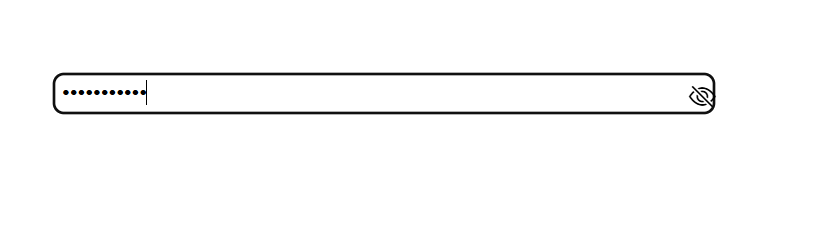
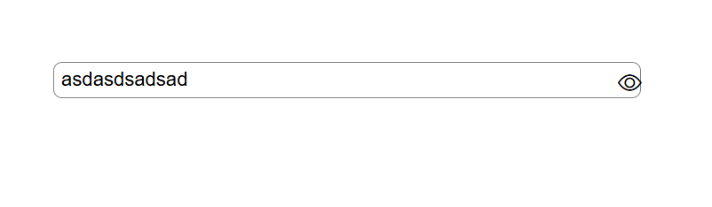
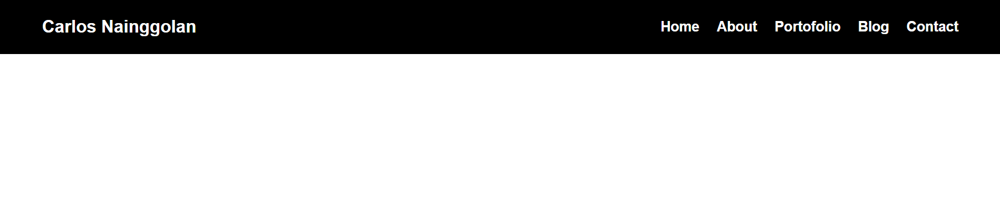

# Event DOM
## Making input password and navbar

1. Tampilan awal input password

2. Tampilan password berupah menjadi text type

3. Tampilan navbar di awal

4. Tampilan navbara setelah diperkecil

